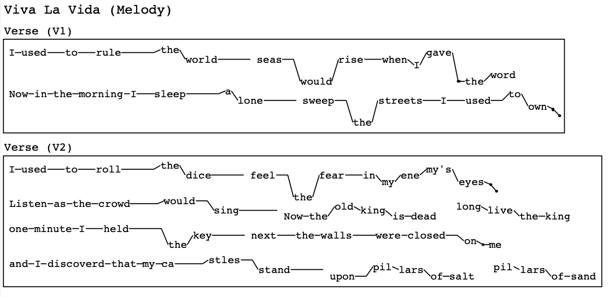

# LyricDrawer
A tool for rendering documents with song lyrics, in a form that evokes pitch and rhythm. See below:



The lyric sheets are intended to be accessible for even those who cannot read sheet music. They do not unambiguously specify the way the lyrics should be sung; however, they should provide enough assistance for somebody to recall the pitch and rhythm if they have previously learned it.

## Installation 
Clone the repository and use pip to install the underlying graphics tool:

```bash
pip install graphics.py
```

## Usage

Pass into the directory	`code` and enter a python interpreter. Enter the following code:
```python
import document
document.LyricDocument(r"../examples/viva_la_vida.txt").draw(lyric_size = 11, margin = 3)
```

This will render the specified lyric sheet. The document will open in a new window. If the lyric sheet supplied is `path/to/file.extension`, then a postscript file will be saved at `path/to/file.eps`. An excerpt from the lyric sheet is seen above. 

You can also make your own lyric sheet, but it must follow a certain format.
### Format of Lyric Sheet
Lyric sheets are read line by line. Each line is either
- an *empty line*, in which case it renders as a blank line in the document, 
- a *text line*, in which case it must 
	- begin with `Title`, `Header`, or `Normal`, 
	- followed by a colon `:`,
	- and then white space, 
	- and then any text which should be rendered,
- or a *lyric line*, described below.

*Lyric lines* are put together into *lyric sections* if they are not separated by any *empty lines* or *text lines*. A lyric section has a rectangle around it in the document. 

### Format of Lyric Lines
Here is an example of what a *lyric line* looks like:

`E: Now in the morning I - sleep ----- F: a D: lone -----; sweep - <G: the >D: streets - I - used - E: to C: own B: * A: *`

A *lyric line* must have a specific format. It is read token by token, where tokens are separated by white space. Each token is either
- a *note token*
- or a *lyric token*

A *lyric line* should always begin with a *note token*. A *note token* indicates the pitch at which the subsequent *lyric tokens* are to be sung.

#### Format of Note Tokens

A *note token* begins optionally with any number of `>` OR any number of `<`
but not both. These indicate octave changes; more on that below. The *note token* is then followed by a valid note name (like `A`, `C#`, or `Eb`) and finally a colon `:`. For example, `Ab:`, `<A#:`, and `>>Cb:` are all valid *note tokens*, but `Ab`, `<AA:`, and `<>Cb:` are invalid.

The *note token* indicates the note at which all subsequent *lyric tokens* are to be sung, until a note change occurs, indicated by new *note token*. 

There might be ambiguity regarding pitch. For example, `A:` can be sung at different octaves. By default, the very first pitch in a *lyric line* is chosen arbitrarily, and after that each pitch is chosen to be as close as possible (in half steps) to the previous pitch chosen. For example, when moving from `A:` to `C:`, the pitch chosen for `C:` is 3 half steps above the previous, rather than 9 half steps below. To indicate that you mean the one below, you would instead write `<C:`. If you want the one an octave further down than this, you would use `<<C:`. The other character `>` similarly indicates a motion upward.

#### Format of Lyric Tokens
Anything that cannot be interpreted as a *note token* will be interpreted as a *lyric token*.
A *lyric token* can be either
- a *tone token*
- a *hold token*
- a *rest token*
- a *word token*

Each token renders in some way on the screen at a height according to the current note being sung. By default there is a line joining each token to the next, unless it is what we call "disconnected," indicated by the character `;` at the end of the token.

#### Tone Token
A *tone token* consists of a single asterisk `*`, optionally followed by a semicolon `;`. This is a note that should be sung without any words.

#### Hold Token
A *hold token* consists of any number of hyphens `-` (ASCII 0x2D) and optionally a single `;` at the end. Each `-` indicates a single beat for which you want to hold (without any words) the note previously sung. 

You can always use `-` in place of `*`, but `*` will render more nicely if you are changing pitches while singing without words.

#### Rest Token
A *rest token* consists of any number of periods `.`, each indicating a single beat for which no sound is made. A rest is always disconnected, and so is the token immediately before the rest.

#### Word Token
Anything that cannot be interpreted as one of the above tokens will be interpreted as a *word token*. The main part of the *word token* is the token itself, or, if the last character is `;`, then everything but the last character. The main part of the *word token* will render in its entirety on a screen, indicating the word to be sung.
